# Website E-Library

Aplikasi e-library sederhana untuk pengelolaan data buku, peminjaman, dan pengembalian secara digital

## Authors

- [@dwifebririyanto](https://www.github.com/dwifebririyanto)
- [@muhammadihsanauliya](https://www.github.com/muhammadihsanauliya)
- [@paulacarneliantobing](https://www.github.com/dwifebririyanto)
- [@muhammadrizkiardian](https://www.github.com/rizki-ardian)
- [@dellafrisca](https://www.github.com/dwifebririyanto)

## Features

- Melihat Dashboard || Admin
- Dapat Melihat dan menghapus member || Admin
- Menambahakan, Mengedit dan menghapus Buku || Admin
- melihat distory Data Peminjaman || Admin
- sign up dan sign in || User
- Pinjam Buku || User
- Koleksi Buku dan Kembalikan Buku || User

## Demo website E-Library
Tampilan umum || UI website

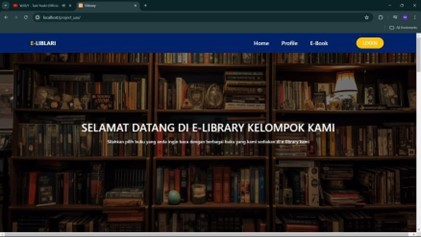

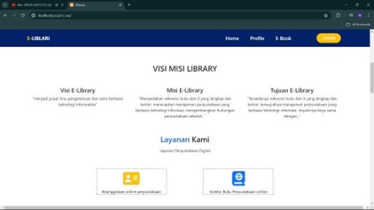

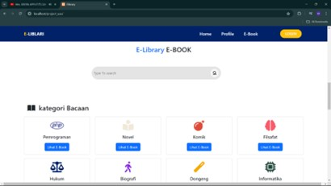

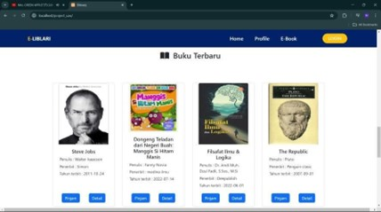

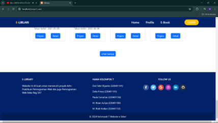

Tampilan Login dan Sign UP

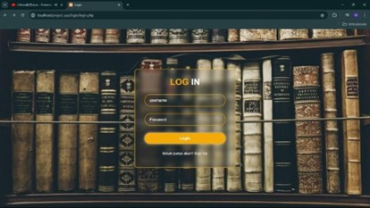

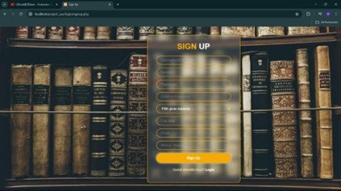

tampilan Dashboard || admin

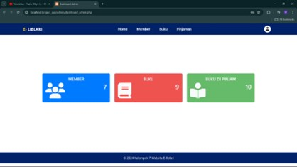

Tampilan data member || admin

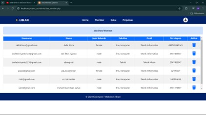

Tampilan data buku & tambah buku || admin

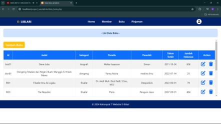

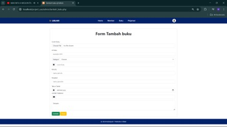

Tampilan data peminjaman & histori peminjaman || admin

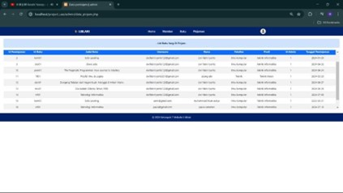

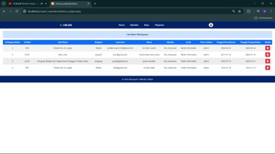

Tampilan pinjam buku || User

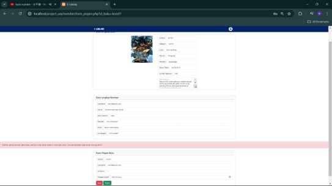

Tampilan koleksi buku & mengembalikan buku || User

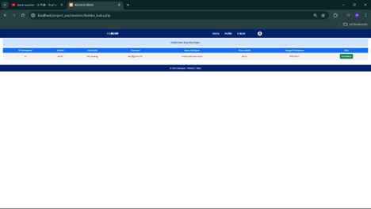

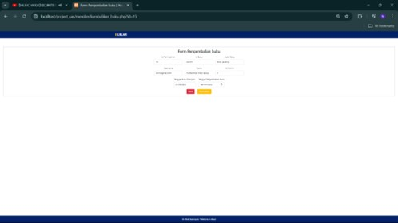
